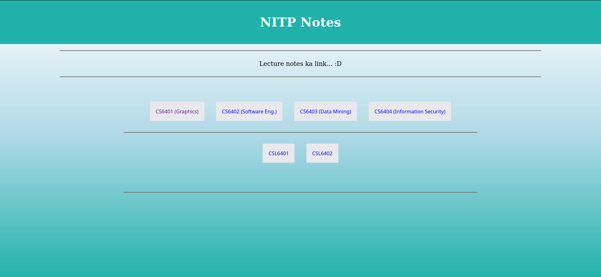
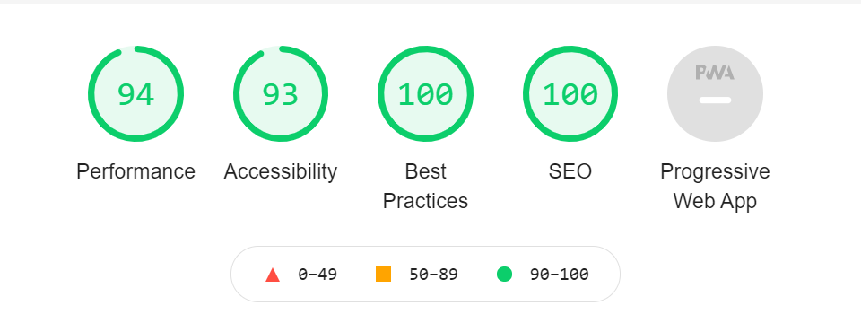

# Lecture Notes links

> यह केवल कॉलेज मेल आईडी के माध्यम से पहुँ खुलेगा 

For and By the NITP 2k19-23 batch.

Provides decrypted lecture notes, download and read, no need to always enter password.

> See the `src/pages/index.tsx` file for code, it is the main code for the page you see at https://cs4401.netlify.app

There are in-code comments, for any further issue/\`any\` doubt, raise an issue here or dm.

> Ye originally [CS4401](https://github.com/adi-g15/CS4401) wale project pe based hai

### Lighthouse statistics

Made for anyone who wishes to make it easier to get notes for all
